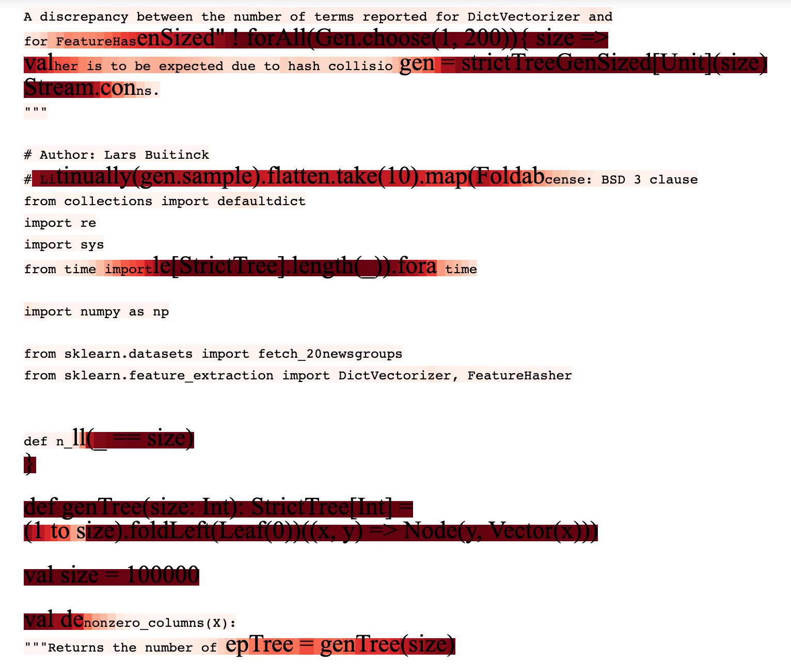

# Tagging Characters with RNNs

The code in this repo is based on [this post](http://nadbordrozd.github.io/blog/2017/06/03/python-or-scala/) by [Nadbor](http://nadbordrozd.github.io/). However, the repo is self-contained, so one can understand the process just by going through the files here.

I have adapted the code so it works with python 3 and implement the process using `Pytorch`.

## The goal

Our aim here is the following: given some text that comes from multiple sources (e.g two different programming languages or two different writers), can we train a RNN to find which characters belong to each of the sources?

For example, the text below is comprised by bits of `python` and `scala` code stitched together. Can we find out where the `python` ends/begins and the `scala` begins/ends?.

<p align="center">
  
</p>

Scala is dark red and python is the lighter tone. The color scale represents to the corresponding probability. The results are pretty good.

## The code


There is a `run_all.sh` file that you could run by

```bash
bash run_all.sh
```

Or you could have a look to the files one by one. The *"flow of the code"* is:


1. Get the data. We will download 2 sets of files. One to compare `python` and `scala` sequences of text and another to compare Jane Austen's and Shakespeare's  books

	```bash
	bash get_data.sh
	```

2. Prepare input files:

	```python
	python prepare_input_files.py data/austen 'austen.txt' data/austen_clean
	python prepare_input_files.py data/shakespeare/ 'shakespeare.txt' data/shakespeare_clean
	python prepare_input_files.py data/scikit-learn '*.py' data/sklearn_clean
	python prepare_input_files.py data/scalaz '*.scala' data/scalaz_clean
	```

3. I have included a little script to split the books in a way that each partition "makes sense", meaning contains enough text and the text corresponds to chapters, episodes, etc:

	```python
	python split_ebooks.py
	```

4. train/test split

	```python
	python train_test_split.py data/austen_clean/ 0.25
	python train_test_split.py data/shakespeare_clean/ 0.25
	python train_test_split.py data/sklearn_clean/ 0.25
	python train_test_split.py data/scalaz_clean/ 0.25
	```

5. Train the network to distinguish between `python` or `scala` code (just change the corresponding directories to compare Austen and Shakespeare)

	```python
	python train_pytorch.py models/model_pytorch data/sklearn_clean/ data/scalaz_clean --bidirectional
	```

6. Tag the characters as being `python` or `scala` code:

	```python
	python apply_tagger_pytorch.py models/model_pytorch output/sklearn_or_scala_preds_pytorch data/sklearn_clean/ data/scalaz_clean
	```

7. And finally plot the output to pretty html files:

	```python
	python plot_predictions.py output/sklearn_or_scala_preds_pytorch output/sklearn_or_scala_preds_pytorch_html
	```

As always, explanatory notebooks in the `notebooks` dir.
